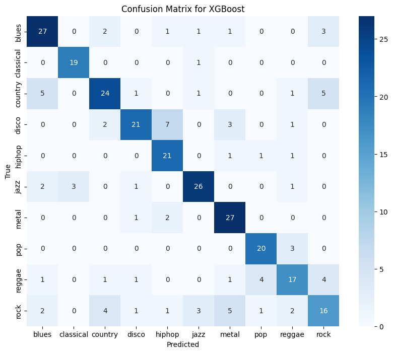

# Music Genre Classification
---

## Abstract
The rapid growth of digital music libraries has increased the need for automated methoods of organizing and classifying music. Music genre classification is a common task within music information retrival, where machine learning techiniques are used to assign songs to predefined genres based on their audio characteristics. This project utilizies XGBoost classifier for predicting music genres using the GTZAN dataset.

---
## Versions
- Python: 3.11.5
- Sklearn: 1.9.0
- Librosa: 0.11.0
- Numpy: 2.4.6
- Pandas: 3.0.3

---
## How to use it

git clone https://github.com/MarkussEzergailis/Music-Genre-Classification.git 
cd Music-Genre-Classification
pip install -r requirements.txt 
streamlit run dash.py

---
## Results

